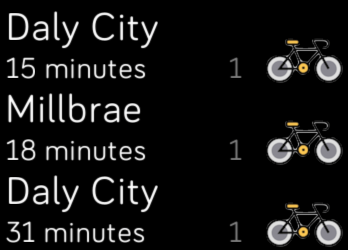

# Bay Area Rapid Transit (BART)

Fitbit SDK example application which downloads real-time BART data and show
upcoming trains for a station of your choice.

Find out more information on the
[Fitbit Developer Website](https://dev.fitbit.com).

## License

This example is licensed under the [MIT License](./LICENSE).
